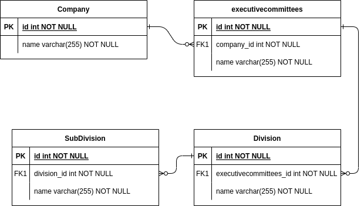

## Table of Contents

- [Requirements](#requirements)
- [Instalation](#instalation)
- [API Documentation](#api-documentation)
  - [Postman Documentation](#postman-documentation)
- [ERD (Entity Relationship Diagram)](#erd-entity-relationship-diagram)


## Requirements

- Go version 1.15 or higher
- PostgreSQL (13 or higher)


## Installation
1. Clone the repository:

   ```bash
   git clone https://github.com/salmaqnsGH/dataon-practicak-test.git
   ```
2. Install the dependencies:
    ```bash
    go get
    go mod tidy
    ```
3. import psql file to your local database in /docs/psql
4. configure your database connection in main.go file
5. Run the application:
    ```bash
    go run main.go
    ```

## API Documentation
### Postman Documentation

https://documenter.getpostman.com/view/14858801/2s9YRB2XLi

## ERD (Entity Relationship Diagram)

